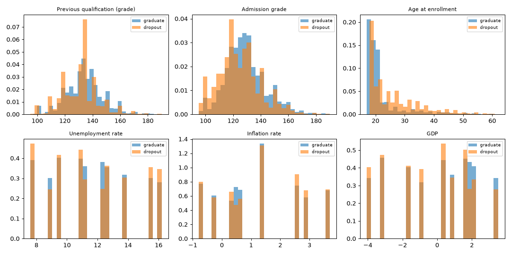
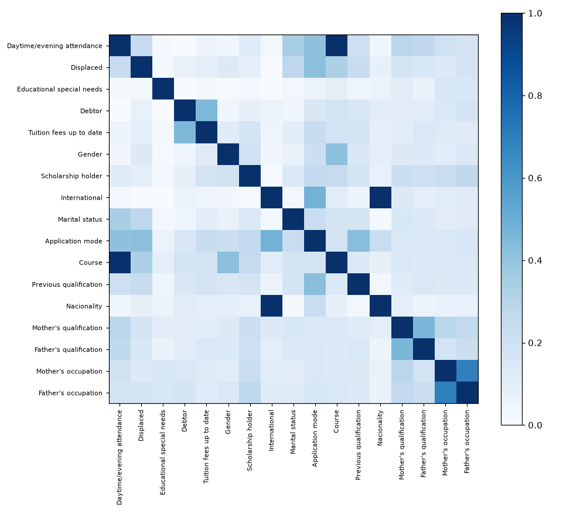
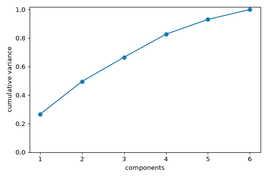
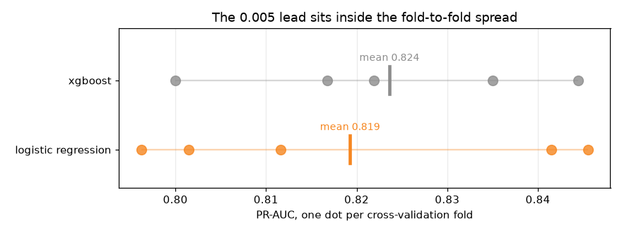
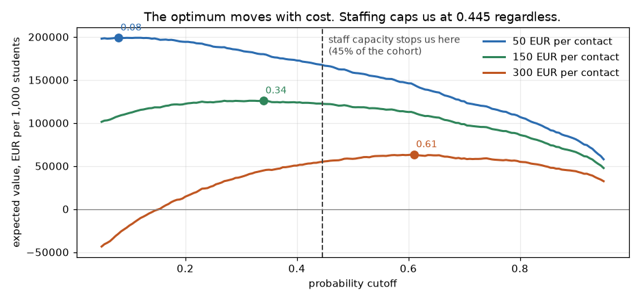
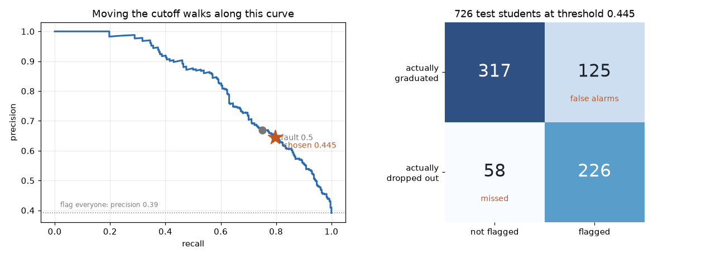
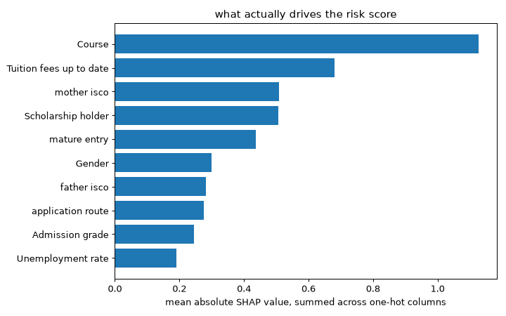
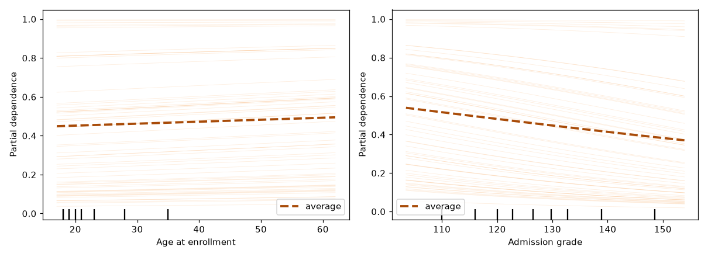

# Predicting Student Dropout, with a Fairness Audit

**Capstone report, PGD AI/ML, Pillar 5.**
This is a machine learning project from start to finish. It predicts which students are at risk of dropping out of higher education. It uses only what the school knows when a student first enrolls. Then it checks the model for bias before anyone trusts it.

Repository: **https://github.com/jeryldev/pgdaiml-capstone**

The full code lives there. There is one notebook per step, and the outputs are saved. So you can check every number in this report without running anything. This report tells the whole story, from how I framed the problem to how I tested for fairness. It also covers the parts I got wrong on the first pass.

---

## Executive Summary

Every year some students leave higher education before finishing their degree. The cost falls on three sides. It hurts the student, the school, and society. A tool that spots who is at risk early, around the time a student enrolls, lets a support team reach those students before they leave.

This project builds that tool on real data from a Portuguese polytechnic. Then it does the harder work of checking whether the tool is fair.

The final model is a logistic regression. This is a simple method that adds up weighted signals to score each student. I set a cutoff on purpose to match how many students the school can actually support. At that cutoff the model catches **79.6 percent** of the students who go on to drop out, using only what is known at enrollment, but it flags women less reliably than men. The version I recommend shipping adds the Step 5 fairness fix. It brings recall to **71.8 percent** and closes the gender recall gap from 0.177 to 0.009, at a cost of about 8,000 EUR per 1,000 students. It is simple enough to explain its own decisions. In this project that turned out to matter more than any accuracy figure.

Four findings are worth leading with. Every one of them came from fixing a mistake.

**The model is not mostly a money model.** To find out what drives the score I used SHAP. SHAP measures how much each feature pushed a given prediction up or down. At first that weight was spread across many tiny yes or no columns. Once I added it back up onto the real feature each column came from, the picture changed. The strongest driver is **which course a student enrolled in**, far ahead of everything else. Whether tuition is paid sits second. **What the student's mother does for a living** sits level with holding a scholarship, right behind it. So the model is mostly spotting students who started from further back, not students in trouble.

**The fairness verdict is not "everything fails."** My first check looked at four groups we cared about. These were gender, age, scholarship, and debt. The check asked whether the model flags each group at the same rate. By that test all four failed. None stayed inside the usual safe ratio of 0.8. But that was the wrong question for three of the four. Students who owe the school money drop out 76 percent of the time, against 34 percent for the rest. A model that flagged them at the same rate as everyone else would be ignoring a real 42-point gap on purpose. The fix is to put the model's flagging gap next to the real gap in the world. Only debt flags below its real gap. The model widens the gaps for scholarship, gender, and age. Gender is the one that matters, because gender is a protected trait. Scholarship is not, and its flagging tracks real risk. The age gap may involve a protected trait and is not yet resolved.

**The real harm is a recall gap.** Recall means how many of the true dropouts the model actually flags. The model catches **87.7 percent of male dropouts and 70.0 percent of female ones**. Three in ten women who go on to leave are never flagged at all. You cannot see this by looking at flagging rates. It shows up only when you stop counting flags and start counting mistakes.

**And rigor does not carry over on its own.** In Step 4 I refused to call a 0.005 lead real, because the score swung by 0.020 from one slice of data to the next. Then in Step 5 I quoted fairness numbers to three decimal places off just 130 female dropouts. To check those numbers I used a bootstrap. A bootstrap re-draws the test data thousands of times to see how much a number wobbles by chance. It showed the two fixes are **tied on fairness**. You cannot tell them apart. The only real difference is what each one costs, eight points of recall against nineteen. The harm survived the check. My reason for picking one fix over the other did not.

The honest conclusion is that the model works and should not be trusted blindly. It belongs in the hands of a support team. It should be a ranked list that starts a conversation, not a verdict stamped on a student's record.

---

## Step 1. Problem Framing

### The problem, and who it helps

The data comes from the Polytechnic Institute of Portalegre (IPP), a public higher education school in Portugal. The school and its research team built this dataset to reduce dropout and failure. The plan was to spot at-risk students early so support can be put in place. This project follows the same goal.

The model serves the tutoring and support staff. They cannot watch every student closely, so they need to spend their limited time on those most at risk. The model turns a long list of students into a short ranked one. It puts the students worth contacting first at the top. A correct flag reaches a student who would otherwise slip away. A wrong flag wastes staff time, or misses a student who needed help.

### The task, and why this kind

The original data has three outcomes. These are Dropout, Graduate, and Enrolled. Enrolled means the student was still studying when the record was taken. Their final outcome is not settled yet. A student with no settled outcome cannot teach the model what dropout looks like. So those 794 rows are removed. That leaves two settled outcomes, which fits a yes or no question. The task is **binary classification**, Dropout against Graduate, on 3,630 students at a 39.1 percent dropout rate. Binary classification just means sorting each student into one of two boxes.

The answer we want is a category. A student either drops out or does not. Regression is out because it predicts a number. Clustering is out too because it finds patterns in data with no labels. Here the labels are known. So this is a classification problem.

### How success is measured

The model gives back a score, not a plain yes or no. To turn that score into a decision you need a cutoff. A cutoff is the line above which a student gets flagged. **The cutoff is a choice, not a given.** That idea drives everything later, so it is worth saying which measures depend on it and which do not.

**Two measures choose the model.** Neither one depends on where the cutoff sits.

- **PR-AUC** is built from precision and recall. Precision is how often a flag is correct. Recall is how many of the true dropouts get flagged. PR-AUC ignores the graduates the model correctly leaves alone. So it stays honest on an uneven 39 to 61 split. This is the score the tuning tries to raise.
- **ROC-AUC** is the chance that the model gives a random dropout a higher score than a random graduate. In plain terms it measures how well the model ranks students. That matches how the tool is actually used.

**One measure judges the live system,** once a cutoff exists.

- **Recall on dropout.** Of the students who truly drop out, how many did the model flag? A missed student is the costly mistake. This is the number the school cares about, and the number I would report to them.

But recall cannot pick a model, and the reason matters. **Recall does not belong to a model alone. It belongs to a model plus a cutoff.** You can push recall to 1.0 on any model just by flagging every student. So PR-AUC and ROC-AUC pick the model. Step 4 picks the cutoff on purpose. Only then does recall mean anything.

Accuracy is reported but not trusted. With a 39 percent dropout rate, a lazy model that calls everyone a graduate is right 61 percent of the time while catching no one.

### Business value

Value is the students the school keeps, minus the cost of reaching out to flagged students. Three stated assumptions keep the estimate honest.

- A kept student is worth about **2,100 euros**. This comes from the Portuguese public tuition cap of roughly 697 euros a year over about three years. It is a low estimate on purpose. Tuition is a number I can cite. The wider loss to the student and to society is larger but harder to defend.
- A flag starts a conversation. It does not keep the student on its own. So 2,100 euros is the most a caught student can be worth. I scale it down by how often outreach actually works, taken here as 3 in 10.
- Outreach costs roughly **50, 150, or 300 euros** per flagged student. I give a range because the real figure depends on the school.

These numbers are not decoration. Step 4 uses them directly to choose the cutoff. That is the one place in this project where cost and benefit actually meet.

### Scope

The model fits an IPP style Portuguese polytechnic. It covers 17 undergraduate degrees, from 2008-09 through 2018-19. It is not a general dropout predictor for any school in any country. The method carries over even though the model does not.

---

## Step 2. Data Understanding

### Source and citation

The dataset is the UCI set *Predict Students' Dropout and Academic Success* (Realinho, Vieira Martins, Machado, and Baptista, 2021). It was donated in December 2021 under a CC BY 4.0 license, DOI 10.24432/C5MC89. The Portuguese program SATDAP funded it, grant POCI-05-5762-FSE-000191. The creators joined several separate school databases into one table with one row per student. They say they cleaned the data carefully for odd values, outliers, and missing cells before release. The full citation is in `data/README.md`.

The degrees behind the course codes span a wide mix. They range from Nursing and Veterinary Nursing to Agronomy, Social Service, Journalism, Management, Communication Design, and Basic Education. That spread matters later, because course turns out to be the strongest predictor in the model.

### Overview

**4,424 students, 37 columns.** There are no missing cells and no duplicate rows. That is the providers' careful cleaning, not luck, and I checked it rather than assumed it. The outcome splits into Graduate 2,209, Dropout 1,421, and Enrolled 794.

A full column-by-column data dictionary is saved at **`data/data_dictionary.md`**. It lists each column's type, range, unit, and missing count, and it is built straight from the data in notebook 02.

### Feature types

| Type | Count | Meaning |
|---|---|---|
| True numbers | 6 | Real quantities where order and distance matter, like admission grade and age |
| Yes or no flags | 8 | Stored as 1 or 0, like gender, scholarship holder, and debtor |
| Coded categories | 9 | Numbers that stand for categories, like course and parental qualification. The number is a label, not an amount |
| Ordered count | 1 | Application order, a rank from **0 = first choice** to 9 = last |
| Curricular, leakage | 12 | First and second semester performance, kept out of the model |
| Target | 1 | Dropout, Graduate, Enrolled |

The coded categories are the trap. A course coded 9500 is not bigger than one coded 33. It is just a different course. So it is wrong to treat these as real numbers, to scale them, or to measure plain correlation on them. They are handled as categories throughout.

### First look at disparity

Four groups drive the fairness work in Step 5. These are gender, scholarship, debt, and age. Against an overall dropout rate of 39.1 percent, the gaps between groups are already large before any model exists.

| Group | Dropout rate | n |
|---|---|---|
| Men | 56.1 percent | 1,249 |
| Women | 30.2 percent | 2,381 |
| No scholarship | 48.4 percent | 2,661 |
| Scholarship holder | 13.8 percent | 969 |
| Debtor | 75.5 percent | 413 |
| Not a debtor | 34.5 percent | 3,217 |
| Age 17 to 20 | 26.1 percent | 2,080 |
| Age 21 to 23 | 40.6 percent | 473 |
| Age 24 to 30 | 66.5 percent | 499 |
| Age 31 plus | 61.4 percent | 578 |

**These numbers come back in Step 5. They are the reason I had to redo the fairness audit.** A gap this large already exists in the world. A model does not invent it. Whether the model makes the gap *worse* is a separate question. It needs a different measure to answer.

One column stands apart. Students **behind on tuition drop out 94.0 percent of the time**, against 30.7 percent for those who are paid up. Only 486 students are behind. That is not a normal background fact. A student who has stopped paying is often a student already on the way out. It is almost the outcome itself. I keep it but watch it closely, and Step 3 measures exactly what the model would lose without it.

---

## Step 3. Preprocessing, EDA, and Feature Engineering

### Cleaning and the leakage guard

First the plain data checks. Step 2 found no missing cells and no duplicate rows, and I confirmed both in code rather than trusting them. A range check on the six numerics turned up nothing impossible, only a long tail of mature-student ages that reaches to 70. Those ages are real records, not errors, and age is the strongest numeric predictor, so no rows are cut. Inside the pipeline the numerics are scaled with StandardScaler and the coded categories are one-hot encoded, both fit on the training data only.

The twelve curricular columns record how many courses a student took, passed, and failed in the first and second semesters. That record predicts dropout almost perfectly, because a student failing courses is a student already leaving. A model built on it would score high and help no one. So all twelve are dropped. The model then sees only what is known at enrollment. This trades raw accuracy for a warning that arrives in time to act on. That trade is on purpose.

### The split comes first

I split the data into a training set and a test set before any feature work that looks at the outcome. The split keeps the same dropout rate in both parts and uses a fixed seed so it repeats. That leaves 2,904 training students and 726 test students.

**Every decision in this notebook is made on the training data, including the tuition check below.** My first version of that check compared models on the held-out test set. That was a quiet leak. Any decision made by looking at test results feeds test information back into the model, no matter how small the decision seems.

### What predicts dropout

**True numbers.** Grades and age are lopsided, not bell-shaped, so I used the Mann-Whitney U test. This test compares two groups without assuming any particular shape. Age has the strongest link. Older students drop out more. Admission grade and previous qualification grade come next. Unemployment and inflation show no real difference (p = 0.75 and 0.21).



**Categories.** For these I used two tools together. The chi-square test asks whether a link is real. Cramér's V then rates that link on a scale from 0 to 1, where higher means stronger. Used together they rank categories by a link that is both real and strong. On 3,630 rows almost every link is real, so Cramér's V does the real ranking.

| Feature | Cramér's V |
|---|---|
| Tuition fees up to date | 0.437 |
| Course | 0.346 |
| Application mode | 0.330 |
| Scholarship holder | 0.321 |
| Debtor | 0.269 |
| Gender | 0.255 |

**Overlap between the numbers.** I checked whether the number columns repeat each other, using a score called VIF. A high VIF means one column is largely a stand-in for the others. Every VIF on the true numbers is under 2, which is low. The linear model is safe on that front. But VIF only looks at the six number columns. It says nothing about the yes or no columns, or about any feature built later. That blind spot turns out to matter enormously.



The chart above shows two pairs of categories at a perfect **V = 1.000**, meaning each pair moves in lockstep. I noticed that and moved on. That was a mistake.

### The tuition status check

Tuition status leads the ranking. Its 94 percent dropout rate makes me suspect it is almost the outcome itself. To test that, I trained a logistic regression with it and without it. I scored both with cross-validation inside the training set. Cross-validation splits the training data into several parts, trains on most of them, and tests on the part left out, then rotates. That way the score never touches the test set.

| Version | CV PR AUC | CV ROC AUC |
|---|---|---|
| With tuition status | 0.817 | 0.848 |
| Without tuition status | 0.765 | 0.826 |

Removing it costs five points of PR-AUC. That is too much to give up for a risk that is only a judgement call. It is not a proven leak. The curricular columns were the proven leak. So the tuition flag stays, with a note. A school acting on this model is acting, in large part, on who is behind on payments.

### The feature I threw away

This is the part of the project I would defend first. It started as a failure.

I built a **socioeconomic pressure** score. It gave one point each for owing money, falling behind on tuition, and holding no scholarship. The idea felt right and the numbers agreed. It ranked **first** on mutual information, ahead of every raw column in the file. Mutual information measures how much knowing one column tells you about the outcome.

Then the model's weights came back wrong. Not weak. **Wrong.** The model said owing the school money makes a student *less* likely to drop out, and holding a scholarship makes them *more* likely. The data says the opposite, loudly.

The cause was a hidden overlap. The three source flags added up to the score exactly, on every single training row. Take the score, subtract its three flags, and you always get `2`. So the score was not new information. It was three columns the model already had, added together. There was no single right way to split the weight among four columns that move as one. The model just picked one split at random. That random split was what I had been reading as a real weight.

A rank check on the feature table made it visible. A rank check counts how many columns are truly independent versus how many are just combinations of others.

| | Old matrix | Fixed matrix |
|---|---|---|
| Columns | 216 | **84** |
| One-hot blocks | 9 | 6 |
| Exact linear dependencies | **19** | **6** |

Some overlap is expected. When a category is split into one column per value, the columns in that group always add up to a constant, so each group brings one built-in overlap. Six category groups give six such overlaps. That is normal. The old table had **ten more than it should**. Here is what those ten did.

| Feature | Coefficient, score in matrix | Coefficient, score removed | Actual dropout rate |
|---|---|---|---|
| Debtor | **−0.465** | **+1.006** | 76% vs 34% |
| Scholarship holder | **+0.138** | **−1.344** | 14% vs 49% |
| Tuition fees up to date | −1.480 | −2.913 | 31% vs 94% |

Two of the signs flip. And the reason the feature had to go is not the one I expected. It barely moved accuracy at all, because it never held information the model did not already have. What it did was make the model **unreadable**. Every explanation in Step 5 is read straight off these weights. So a flipped sign here becomes a sentence that tells a student the opposite of the truth.

**A feature that costs nothing and explains nothing is not a harmless extra. It is a liability.**

The same rank check then caught two more repeats. The Cramér's V chart had already flagged both at 1.000.

- `International` is the same as saying the nationality is not Portuguese. It matches on **100 percent** of rows. It is the same column twice.
- `Daytime/evening attendance` is fixed entirely by `Course`. **Zero of 17** courses run both a day class and an evening class.

### Features that replace, instead of repeat

The rule that came out of this is short. **If a new feature is built from columns that stay in the model, it adds nothing to a linear model.** The model already holds that information. A new feature earns its place only if it replaces its source columns, or if it says something the raw columns cannot say on their own.

| Feature | What it does | Replaces |
|---|---|---|
| `mother education tier`, `father education tier` | Sorts about 30 qualification codes onto a 0-to-3 ladder, keeping the order the codes throw away | Both parental qualification columns (63 dummies → 2) |
| `first generation` | On when neither parent reached higher education | Nothing. This is genuinely new. You cannot see it until you read the two columns together |
| `mother isco`, `father isco` | Groups the many occupation codes into a handful of broad job families | Both parental occupation columns (71 dummies → 12) |
| `application route` | Groups 18 application codes into 5 routes an admissions officer would recognise | Application mode |
| `mature entry` | On when age is 23 or over, Portugal's *Maiores de 23* route. Age enters as a straight line, but risk jumps at that route, and a straight line cannot bend | Nothing. It lets the age term bend |

All of this lives in `src/features.py`. So Steps 4 and 5 read one definition instead of passing copies around. None of it looks at the outcome.

### Feature selection, actually applied

Here is the mutual information ranking on the features the model actually uses. Again, this measures how much each feature tells you about the outcome.

| Feature | MI |
|---|---|
| Tuition fees up to date | 0.1033 |
| Age at enrollment | 0.0663 |
| Course | 0.0623 |
| Scholarship holder | 0.0575 |
| Previous qualification (grade) | 0.0559 |
| **mature entry** | **0.0534** |

`mature entry` lands sixth, below the raw age column it bends. That is the honest order. Mutual information already sees the whole age signal on its own. Whether the bend earns its place is a modeling question. This ranking does not settle it.

Last time I printed a ranking like this, wrote a sentence about which features were weakest, and then trained on every single one of them anyway. **A ranking that changes nothing is not feature selection. It is just a chart.** So this time four columns actually come out. They are `Nacionality`, `International`, `Daytime/evening attendance`, and `Educational special needs`. And I measure what dropping them costs.

| | CV PR AUC | Columns |
|---|---|---|
| Every raw feature | 0.817 | 215 |
| Engineered and selected | **0.819** | **84** |

Sixty percent of the columns are gone, and the score went slightly **up**. The gain is too small to be real, and that is fine. The point is that cutting 131 columns costs nothing.

### Dimensionality reduction



PCA is a way to squeeze many columns into a few combined ones that carry most of the information. Run on the nine number columns, it needs **seven of the nine** combined columns to keep 90 percent of the spread in the data. So there is almost nothing to compress here. That matches the low overlap the VIF check already showed.

That is an honest negative result, and last time I left it there. **A chart that no model ever uses is not really a method applied.** So PCA goes into Step 4 as a seventh model and has to earn its seat against the other six.

---

## Step 4. Modeling and Comparison

I tuned seven models inside five-fold cross-validation on the training set. That means each model was tried on five rotating slices of the training data, with the dropout rate kept steady in every slice. To handle the mild imbalance I gave the rarer class more weight, a light touch that fits a 39/61 split. I did not make up fake extra dropouts. The test set is scored just once, at the very end. Each model's best settings are saved to `models/metrics.json`, so every row here can be rebuilt.

| Model | CV PR AUC | Test PR AUC | ROC AUC | Recall | Precision | F1 |
|---|---|---|---|---|---|---|
| XGBoost | **0.824** | 0.828 | 0.857 | 0.746 | 0.665 | 0.703 |
| Random forest | 0.820 | 0.823 | 0.855 | 0.725 | 0.669 | 0.696 |
| **Logistic regression** | 0.819 | 0.822 | 0.851 | 0.750 | 0.670 | 0.708 |
| Logistic regression + PCA | 0.818 | 0.821 | 0.852 | 0.757 | 0.666 | 0.708 |
| SVM | 0.808 | 0.817 | 0.858 | 0.722 | 0.704 | 0.713 |
| MLP (neural net) | 0.752 | 0.753 | 0.798 | 0.669 | 0.667 | 0.668 |
| Decision tree | 0.723 | 0.699 | 0.762 | 0.683 | 0.601 | 0.639 |

**PCA lands fourth**, one thousandth behind plain logistic regression. Swapping the nine number columns for six combined ones costs almost nothing and buys almost nothing. That is a measured answer, and it is why PCA does not make the final cut. Each combined column is a blend of nine real columns. So a student flagged by it could never be told why in any way that means something.

**The neural network loses**, below everything except the lone decision tree. That answers the question it was there to ask. Deep learning does not beat tree models, or a simple straight-line model, on data this small and this table-shaped.

### Is the XGBoost lead real?

XGBoost leads by 0.005. Before trusting that lead, look at how much the five slices disagreed with each other.

| Model | Mean | Std | Folds |
|---|---|---|---|
| Logistic regression | 0.819 | **0.020** | 0.796, 0.841, 0.812, 0.801, 0.846 |
| XGBoost | 0.824 | 0.015 | 0.800, 0.835, 0.822, 0.817, 0.844 |

**The gap is 0.005. The slices swing by 0.020.** The lead is smaller than the normal wobble in the data. Rerun with a different random seed and the order could flip. So XGBoost is not better than logistic regression on this data. It is tied, and it just happened to land on top.



The chart makes the case. Each dot is one slice. The two ranges overlap almost completely, and the small gap between their averages vanishes inside that overlap.

**The choice is logistic regression.** Not because it scores highest. It does not. When two models are tied, the tiebreak should be something that matters. Here that is whether a student can be told why they were flagged. A logistic regression weight is a number a tutor can read out loud. A stack of 300 boosted trees is not.

### The threshold nobody chose

Every recall figure above uses a cutoff of 0.5. **Nobody actually chose 0.5.** It is just the software default. On this data it happens to flag 44 percent of the students. So recall at 0.5 tells you about the default setting, not about the model.

Step 1 wrote down a business case and then never used it again. This is where it belongs. The cutoff is chosen on the training data, using the held-out slices from cross-validation, and applied to the test set only once.

| Rule | Threshold | Recall | Precision | Flagged |
|---|---|---|---|---|
| Default 0.5 | 0.50 | 0.750 | 0.670 | 43.8% |
| Capacity 50% | 0.38 | 0.838 | 0.609 | 53.9% |
| **Capacity 45%** | **0.45** | **0.796** | **0.644** | **48.3%** |
| Capacity 40% | 0.50 | 0.750 | 0.670 | 43.8% |
| Capacity 35% | 0.57 | 0.697 | 0.723 | 37.7% |
| Capacity 30% | 0.64 | 0.630 | 0.768 | 32.1% |

**The 0.5 default is really a decision to staff for 40 percent of students.** That is all it ever was, a staffing choice made by accident through a software default. Move the cutoff to 45 percent and recall climbs to **0.796** on the same model and the same data. The 45 percent is a target set on the training folds. On the unseen test set it lands at 48.3 percent flagged. The cutoff itself is 0.445, which the table rounds to 0.45.

One thing to be clear about. Giving the rarer class extra weight makes it easier to flag, but it also throws off the meaning of the raw scores. So a score of 0.445 does not mean a student has a 44.5 percent chance of dropping out. It just means a place in a ranking.

That is fine, and it is worth saying why rather than glossing over it. Nothing later needs the score to be a true chance. The capacity rule just picks a spot in the ranked list, which only needs the order to be right. The value table below counts what actually happened at each cutoff rather than trusting the scores to be real chances. And Step 5 promises to never show the score to a student at all. These are ranking scores. Only the ranking is ever used.

Then the Step 1 numbers get a say.

| Outreach cost | Best threshold | Flagged | Recall | Value per 1,000 students |
|---|---|---|---|---|
| 50 EUR | 0.08 | 93.1% | 0.996 | 199,022 EUR |
| 150 EUR | 0.34 | 59.4% | 0.870 | 125,289 EUR |
| 300 EUR | 0.61 | 34.4% | 0.658 | 58,967 EUR |



The economics say **flag broadly**. A saved student is worth about 630 euros on average, against 150 euros to reach one. So at the middle cost the model wants to contact 59 percent of the students. That is a strange thing for a targeting tool to say, and it is worth sitting with rather than hiding. When a save is worth four times what a contact costs, a wrong flag is cheap and a missed student is not. There is barely any narrowing-down left to do.

**The chart caught me being sloppy, and the table had let me get away with it.** I had written that staff time runs out long before the economics do. Look at the 300 EUR curve. It peaks at **0.61, higher than the capacity line**. At that cost the economics want *fewer* flags than the tutoring team could handle. So capacity is not the limiting factor at all.

So the honest version has a condition. Staff capacity is the limit at 50 and 150 EUR per contact. At 300 EUR the money runs out first. Which case the school is in depends on a number I do not have. Three rows of a table let me skate past that. The curve does not.

What holds either way. **The ranked list is the product. The yes or no flag is not.** A tutor working down a list from most at risk to least does not need a cutoff, and does not care which limit bites first.

A cutoff is still needed to run the fairness audit and to report one honest number. So it goes at **0.445**, the capacity-45-percent point. This assumes staff capacity is the limit, which is the case at the low and middle outreach costs.

The cost of fitting to capacity instead of chasing the most profit is small, and that deserves a number. The rows above show the most profitable cutoff for each cost. At the chosen cutoff of 0.445 the value drops a little, to **171,942, 123,595, and 51,074 EUR per 1,000 students** at 50, 150, and 300 EUR a contact. At the middle cost that is 1,694 below the best case of 125,289. So fitting the tool to what the tutoring team can staff is very nearly free.

### At the operating point



| | Not flagged | Flagged |
|---|---|---|
| **Actually graduated** | 317 | **125** |
| **Actually dropped out** | **58** | 226 |

226 leavers caught. 58 missed. And **125 graduates contacted who were never going to leave**. Those 125 are the real cost of this tool, and they are not free. A student pulled into a retention conversation they did not need has been told, in effect, that a system thinks they are failing.

Step 5 asks who those 125 students are. The answer is not spread evenly.

---

## Step 5. Ethics, Bias, and Fairness

### How the model decides



**This chart was wrong the first time, and wrong in a way that was hard to see.**

It drew one bar per column in the feature table. But `Course` is not one column. It is seventeen yes or no columns, one per course. So its importance got chopped into seventeen small bars, none big enough to notice. Meanwhile a single flag like tuition status kept all its weight in one bar. Features with many categories were being buried by the way they were encoded, and I was reading the result as if it meant something.

Here is the same chart with each feature's weight added back up onto the original feature.

| Feature | Mean absolute SHAP |
|---|---|
| **Course** | **1.126** |
| Tuition fees up to date | 0.680 |
| **mother isco** | 0.509 |
| Scholarship holder | 0.507 |
| mature entry | 0.436 |
| Gender | 0.301 |

*(A second bug lived here too. If you hand the SHAP tool a plain array, it quietly picks a random sample of 100 rows to work from, with no fixed seed, so the numbers drift on every run. Tuition came out at 0.90 one run and 0.68 the next. The tool now uses all 2,904 rows. An explanation that changes when nothing else changed is not an explanation.)*

One caution on that ordering, because it is thinner than it looks. Mother's occupation reads 0.509 and holding a scholarship reads 0.507. That is two thousandths apart. In Step 4 I refused to call a 0.005 lead real when the data wobbled more than that, and nobody has measured how much this SHAP ranking wobbles. So this report does not claim which of those two is higher. It does not need to. Course at 1.126 is far ahead of everything, and a parent's occupation sits well above admission grade at 0.245 either way.

This does not undo Step 3, where tuition led. Those earlier rankings, Cramer's V and mutual information, measure raw association one column at a time. SHAP measures something different. It measures how much the fitted model actually leans on each feature. Course leads on SHAP because its seventeen categories carry weight together that no single-column score can see. The two measures answer different questions, so they do not clash.

**That changes what this project is about.** The story I had was a money story about tuition, scholarship, and debt. It is still there and still strong. But the thing above it is **which course a student enrolled in**. And sitting level with the money signals is **what the student's mother does for a living**.

Neither is a warning a student can act on. Nobody chooses their mother's job, and by the time the model runs, the course is already picked. So the model is not mostly finding students in trouble. **It is largely finding students who started from further back.**



Risk climbs with age and falls with admission grade. The thin lines, one per student, run parallel. That is exactly what a simple straight-line model with no interactions should look like. This is a check passing, not a new finding. But it is worth showing, because an average line can hide a feature that pushes half the students one way and half the other.

### Limits, stated honestly

- **Imbalance.** A 39 percent dropout rate is only mildly uneven. Extra weight on the rarer class handles it. PR-AUC is the lead measure.
- **Leakage.** The model uses only what is known at enrollment. Tuition status is the softer, watched case, and its cost was measured on the training data, not on the test set.
- **Unreadable weights.** This limit is here because it nearly ruined the project. Every explanation is read straight off the model's weights. A weight with the wrong sign becomes a sentence that tells a student the opposite of the truth. The rank check is now a standing guard. Six built-in overlaps for six category groups, and not one more.
- **Overfitting.** Training PR-AUC is 0.840 against 0.822 on the test set, a gap of 0.018. So the model learned the real pattern, not the noise.
- **Scope.** IPP-style school only.

### The fairness audit, and the metric I was using wrong

The first audit used a test called demographic parity on all four groups. It found every one below the 0.8 line and concluded the model fails on all four. **That conclusion was too easy, and it was partly wrong.**

Demographic parity asks whether the model flags each group at the same rate. That is the right question when the groups do not really differ. It is the wrong question when they do. Students who owe money drop out at 76 percent, and the rest at 34 percent. Asking for equal flagging across that would be asking the model to ignore a 42-point difference it can plainly see. **That is not fairness. That is asking the model to be wrong on purpose.**

So the real-world gap goes into the table, right next to the model's gap. If the model's flagging gap is about the same size as the real outcome gap, the model is just **reporting** a difference that already exists. If the model's gap is bigger, the model is **making** the difference worse.

| Attribute | Real gap in outcomes | Flagging gap (DP) | DI ratio | Error gap (EO) | Recall gap |
|---|---|---|---|---|---|
| **Gender** | 0.238 | **0.350** | 0.496 | 0.290 | **0.177** |
| Scholarship | 0.318 | 0.500 | 0.171 | 0.385 | 0.283 |
| **Debtor** | 0.392 | **0.369** | 0.545 | 0.199 | 0.199 |
| Age band | 0.433 | 0.558 | 0.369 | 0.572 | 0.253 |

A quick guide to the table columns. "Flagging gap (DP)" is the demographic parity gap, the difference in how often two groups get flagged. The "DI ratio" is the disparate impact ratio, the flag rate of one group divided by the other, where anything below 0.8 is the usual warning sign. "Error gap (EO)" and "recall gap" measure fairness in the mistakes, not the flags. Equalized odds (EO) asks whether the model makes errors at the same rate for each group.

One note on the real-gap column. It uses the dropout rates on the 726 test students, so it can be set beside the model's test-set flagging gaps. Those rates differ a little from the full-data rates in Step 2. Gender reads 0.238 here against 0.259 there, because the split lands 154 dropouts among 288 test men and 130 among 438 test women.

**Debt.** Real gap 0.392, flagging gap 0.369. The model's gap is *smaller* than the one in the world. It is under-reporting a real difference, not inventing one. Its disparate impact ratio of 0.545 sits well below 0.8, and the old audit called that a failure. It is not. Debt is not a protected trait, and flagging debtors and non-debtors at the same rate is not something anyone should want.

**Gender.** Real gap 0.238, flagging gap **0.350**. The gap the model creates is *bigger* than the gap in the world. **The model is making it worse.** This is the one group here where demographic parity asks exactly the right question and gets back a bad answer.

**Scholarship.** Real gap 0.318, flagging gap 0.500. The model's gap is bigger here too, and by more than it is for gender. So the model amplifies this one. It does not just report it. What saves it is the same thing that saves debt. Scholarship is not a protected trait, and the heavier flagging tracks a real risk. Scholarship holders drop out at 14 percent against 48 percent for the rest. Its low disparate impact ratio of 0.171 looks alarming and is not.

**Age band.** Real gap 0.433, flagging gap 0.558. The model amplifies this one as well. Age is not like scholarship and debt. Age can be a protected trait, and its error gap of 0.572 is the largest in the table. This one is not settled, and the residual risk section comes back to it.

### The harm, which is not the one I expected

| Gender | Flag rate | Recall | False alarm |
|---|---|---|---|
| Male | 0.694 | **0.877** | 0.485 |
| Female | 0.345 | **0.700** | 0.195 |

The model flags men twice as often as women. Their false alarm rate is more than double too. So a man who would have graduated fine is far more likely to be pulled into a conversation he did not need.

But look at recall. **0.877 for men. 0.700 for women.**

**Three in ten women who go on to drop out are never flagged at all.** For men it is closer to one in eight. The students this tool exists to reach are being missed, and they are missed more often if they are women.

That is the finding. Not "every group fails disparate impact," which was true and useless. The model is quietly worse at its actual job for women than for men. No amount of staring at flagging rates would have shown that. It shows up only when you stop counting flags and start counting **mistakes**.

Whether the model should see gender at all is a separate question, and the answer is not the obvious one. Dropping the gender column does not remove gender. The model still sees Course, the strongest thing it uses, and courses in this data are strongly split by gender. **Removing a protected trait from a model that keeps its stand-ins makes the bias harder to measure without making it any smaller.**

### Mitigation, and what each one charges

Both methods aim for **equalized odds**, not demographic parity. Equalized odds means matching the error rates across groups. The harm here is an error gap, so the fix has to work on errors, not flags. Both methods use a fixed seed, so their numbers hold still between runs.

| Approach | Recall | Precision | Accuracy | Flagging gap | Error gap | Recall gap |
|---|---|---|---|---|---|---|
| Baseline at 0.45 | **0.796** | 0.644 | 0.748 | 0.350 | 0.290 | 0.177 |
| Threshold optimizer | 0.609 | 0.783 | 0.781 | 0.100 | 0.026 | 0.026 |
| **Exponentiated gradient** | **0.718** | 0.685 | 0.760 | 0.131 | 0.027 | **0.009** |

Reading those numbers, my first instinct was to say the second method closes the recall gap *better*, 0.009 against 0.026.

I should not have said that, and Step 4 is the reason why.

In Step 4 I refused to hand XGBoost the win for a 0.005 lead, because the data swung by 0.020 and a gap smaller than that swing is not real. **Then I came here and quoted fairness numbers to three decimal places off a single 726-student split, without ever asking how much they wobble.** I had been careful in one place and careless in another. So I went back and checked. I re-drew the test set 2,000 times with a fixed seed and re-measured each time. That is the bootstrap.

| | Point estimate | 95% interval | |
|---|---|---|---|
| Baseline recall gap | +0.177 | [+0.082, +0.274] | **real** |
| Threshold optimizer recall gap | −0.026 | [−0.142, +0.090] | indistinguishable from zero |
| Exponentiated gradient recall gap | −0.009 | [−0.118, +0.101] | indistinguishable from zero |
| **TO gap minus EG gap** | +0.008 | [−0.057, +0.076] | **tied** |
| **EG recall minus TO recall** | **+0.109** | **[+0.075, +0.146]** | **real** |

Each 95 percent interval is the range where the true value almost certainly sits. If that range includes zero, the number could just be chance. Three things fall out of the table.

**The harm is real.** The 0.177 gap never crosses zero across two thousand redraws. The model is worse at finding female dropouts, every time. This finding stands.

**But the third decimal was just noise, and I was reading it.** The recall gap rests on **130 female dropouts and 154 male ones**. It does not rest on all 726 test students. 726 is the size of the test set, not the size of the thing this number depends on. **So 0.009 is not better than 0.026. They are the same number in different clothes.** Catching myself making the exact mistake I had refused to make one notebook earlier was a humbling way to learn that care is not a mood you sit in. It is a check you run.

**And exactly one difference survives the test.** That is the recall cost, at +0.109, with a range nowhere near zero. Which means the choice was never really about fairness at all.

### The verdict, on the one thing that survives

**The two mitigations are tied on fairness.** Both close a gap that was genuinely there. Neither is measurably better at it.

**They are not tied on cost, and that is the whole decision.**

The **threshold optimizer** drops recall from 0.796 to **0.609**. That is nineteen points. Look at how it got there. It closed the gap between men and women mostly by catching fewer people overall. So it bought fairness by missing more students of both kinds. Accuracy went *up* while the tool got *worse* at its actual job. That is a useful reminder of how little accuracy is worth on a problem shaped like this.

The **exponentiated gradient** drops recall to **0.718**. That is eight points. It reaches the same fairness, and it keeps eleven points of recall that the other method throws away. This second method is a training approach that builds a mix of models to meet the fairness target while giving up as little accuracy as it can.

**Take the exponentiated gradient.** Eight points of recall is still a real cost, roughly thirty fewer leavers caught per thousand students, and it should be written down plainly rather than buried. What it buys is that those thirty missed students are not loaded onto women.

**What the fix costs, in the same euros Step 4 used.** The Step 1 assumptions have to price this too, or the recommendation is a number nobody can check.

| Per 1,000 students | Leavers caught | Students flagged | Value at 150 EUR a contact |
|---|---|---|---|
| Baseline at 0.445 | 311 | 483 | 123,595 EUR |
| **Exponentiated gradient** | **281** | **410** | **115,455 EUR** |

A saved student is worth 630 EUR after the 3-in-10 uplift, and a contact costs 150. The reduction catches thirty fewer leavers but also flags seventy fewer students, so it claws back some of the loss on outreach it no longer spends. **The fairness fix costs about 8,000 EUR per 1,000 students.** That is roughly one euro in fifteen of the value the tool produces, and it is what the school is being asked to pay to have the tool work as well for women as it does for men. The number belongs on the table, not in a footnote.

The other option was to fix the gap by helping fewer people. That is not a fix.

**One honest note on how this choice was made.** I picked between these two by reading their scores on the **test set**. In Step 3 I caught myself settling the tuition question on the test set and moved it onto the training slices instead, and I was pleased with myself for it. This is the same act. It is easier to defend here, since it is the final comparison of two finalists at the very end. But by the standard I set for myself in Step 3, the stricter way is to choose the fix on the training data and touch the test set exactly once, only to report. I am naming it rather than hoping nobody notices.

### Residual risk, and what I would tell the school

The model works, and it works on things students cannot change. Course comes first, far ahead of everything. A parent's occupation sits level with the money signals rather than below them. Tuition and scholarship, the money problems the school could actually do something about, sit around them.

That suggests a flag is the wrong shape for the help, and Step 4 reached the same conclusion from the economics. A ranked list, read from the top, with the reason attached, is something a tutor can work with. A yes or no at-risk label stamped on a student's record is something that follows them around.

Gender is fixed. Scholarship and debt are not, and that is the right call. Debt the model under-states, and scholarship it amplifies, but neither is a protected trait and both track real risk. **The age gap is genuinely unresolved** and needs its own pass.

Three things I would insist on before this goes near a student.

1. **The score is never shown to the student as a number.** A person told they are 78 percent likely to fail has been handed a prediction, not help.
2. **If the score is built on something the school could change, the school should change it.** Tuition status is the second strongest signal, and a payment plan is a cheaper fix than a tutor.
3. **The recall gap gets re-measured at every intake.** It was 0.177 on this group of students, with a bootstrap range of roughly [0.08, 0.27]. That range is wide, because it rests on just 130 female dropouts. It will not stay fixed on its own, and one group of students is not enough to call it settled.

---

## Reproducibility

```
notebooks/          01 to 05, one per step, run in order, outputs committed
src/                data loader, path helpers, and the feature module
data/               raw (fetched, not committed), processed, and the data dictionary
models/             preprocessor, the Step 4 model, the shipped model, the threshold,
                    and full metrics with hyperparameters
reports/            this report and its figures
.python-version     3.13, read by uv
requirements.txt    exact pins, read off the environment that produced these outputs
```

```bash
./setup.sh                  # uv venv on Python 3.13, install pinned deps, fetch dataset
source .venv/bin/activate
./run_notebooks.sh          # my own script, runs 01 to 05 in order and saves the outputs
```

I wrote `run_notebooks.sh` because re-running five notebooks by hand is a thing I got wrong more than once. You have to run them in the right order, from a clean start, and remember to save each one. The script does all of that in one command. It also locks the project to its own Python, refuses to fall back to the system one, and checks the installed package versions against the saved list before it runs anything.

The order is not optional. Notebooks 04 and 05 read files that 03 and 04 write. Run them out of order and nothing crashes loudly. They quietly run against stale files, which is worse.

Every number in this report comes from running the notebooks in order against the real data with fixed seeds. **I found and closed three sources of silent drift.** All three are worth naming, because not one of them announced itself. In each case the code ran fine to the end and simply wrote down a different answer.

- **The SHAP tool.** Handed a plain array, it quietly picks a random sample of 100 rows, with no fixed seed. Tuition status came out at 0.90 on one run and 0.68 on the next.
- **The exponentiated gradient's predict step.** It returns a random draw from a *mix* of models, not one fixed model. From the same fitted object, the recall gap read 0.012 on one call and 0.001 on the next.
- **The environment itself.** At one point `requirements.txt` was rewritten from versions read off a different machine. That pinned five packages *behind* the ones that had produced every number here. Installing it would have downgraded pandas, numpy, scikit-learn, scipy, and matplotlib, run cleanly, and quietly disagreed with this report.

The first two are seeded now. The third is checked on every run.

**Two models are saved, on purpose.** `model.joblib` is the plain logistic regression, and every number in Step 4 is read off it. `model_shipped.joblib` is the one this report recommends deploying, the same model under the equalized-odds constraint, and it carries the fitted preprocessor with it because the reduction was fit on the encoded matrix rather than on raw columns. `metrics.json` carries a `shipped` block naming which is which, along with the recall before and after, the bootstrap interval on the gap, and what the fix costs. Saving only the first would have left `models/` describing a system Step 5 says should not be deployed.

Everything else is seeded at 42. That covers the split, the cross-validation slices, mutual information, PCA, all seven models, both fairness fixes, and the Step 5 bootstrap. The notebooks are committed **with their outputs**, so every table and chart here can be checked on GitHub without running anything.

---

## Conclusion

The project delivers a working early-warning model for student dropout. It uses only what is known at enrollment. On its own it catches **79.6 percent** of true dropouts at a cutoff chosen to match the school's real staffing capacity. The version I recommend shipping adds the Step 5 fairness fix, which trades that down to **71.8 percent** to close the gender recall gap from 0.177 to 0.009. And it stays simple enough to explain its own decisions.

It also produced four lessons, and each one came from catching a mistake I had made.

**A feature that adds no information cannot help a model, but it can still break it.** And it breaks it in the place that matters most, which is the model's ability to say why.

**The model's strongest signals are things students cannot change.** These are course and parental occupation. That is not a bug to patch out. It is what the data says, and a school deploying this should know it before it starts flagging people.

**The harm was not where the standard fairness test was pointing.** Demographic parity said all four groups failed. The truth was messier. The model under-stated only debt. It widened the gaps for scholarship, gender, and age. Gender was the one that mattered, because gender is protected. The damage showed up as a recall gap that no flagging-rate test could see.

**And rigor does not carry over on its own.** In Step 4 I refused to call a 0.005 lead real when the data swung by 0.020. Then in Step 5 I quoted fairness numbers to three decimal places off just 130 female dropouts, as if the wobble had stayed behind in the other notebook. It had not. The bootstrap that caught this did not overturn the finding. The recall gap is real. But it did overturn the *reason* I gave for choosing one fix over the other. Skepticism is not a stance you adopt once and carry around. It is a check, and you have to run it everywhere it applies.

A dropout model is not a scoreboard. It is a decision about which students get help. The right way to use this one is as a ranked prompt for a support team, checked by a person, aimed at starting a conversation early enough to matter.

---

## References

- Realinho, V., Vieira Martins, M., Machado, J., & Baptista, L. (2021). *Predict Students' Dropout and Academic Success* [Dataset]. UCI Machine Learning Repository. DOI 10.24432/C5MC89. License CC BY 4.0.
- Martins, M. V., Tolledo, D., Machado, J., Baptista, L. M. T., & Realinho, V. (2021). Early prediction of student's performance in higher education: a case study. *Trends and Applications in Information Systems and Technologies* (WorldCIST 2021), AISC vol. 1365, Springer, pp. 166–175. DOI 10.1007/978-3-030-72657-7_16.
- Funding: SATDAP, Capacitação da Administração Pública, grant POCI-05-5762-FSE-000191, Portugal.
